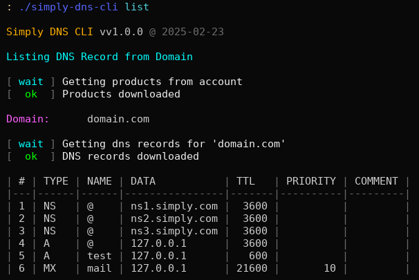
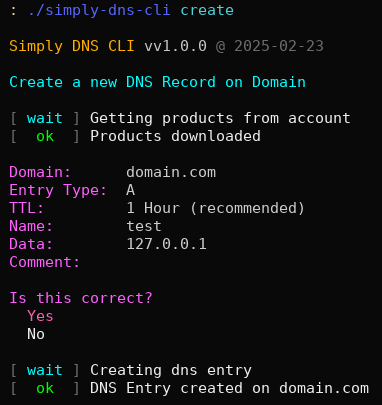
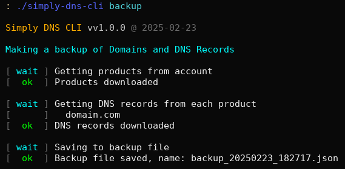

# Simply DNS CLI

Tool for managing Simply.com DNS entries on multiple domains of an account.

Features:  
* Get a list of all dns entries on a domain
* Management
  * Create new dns entries on a domain
  * Update existing dns entries on a domain
  * Remove existing dns entries on a domain
* Backup all domains and dns entries for an account  
* Restore all dns entries for a domain from a backup

## Configuration

To use the tool you need to create a configuration file containing your Simple.com API Credentials.

The config file must be named `config.json` and placed either in `~/.config/simply-dns-cli` or besides the executable.

The config.json file should contain the following:

```json
{
	"simply_api": {
		"url": "https://api.simply.com/2",
		"account_number": "<Simply.com Account-number (Sxxxxxx)>",
		"account_api_key": "<API-Key for that specific account>"
	}
}
```

Both the `Account-number` and `API-Key` can be found by:
* Going to [Simply Control panel](https://www.simply.com/dk/controlpanel/).
* Clicking on `Account <account number>` in the left menu.
* Then clicking on the `Account management` button at the top of the page.
* Then on the right side of the page under `General information` section, you will see `Account no.` and `API key`

Now you should be able to run the tool.

## Usage

Using the tool is a simple as calling it with one of the supported commands and optional arguments.  
If no arguments are provided to the command, it will ask you for the required values.

You can always use the `--help` option to get help for each command.

Example, the `list` command requires the domain name e.g. domain.com, to be able to list the DNS Records associated with it.  
So you could either just run: `simply-dns-cli list` command, and the tool will provide you a list of all the domains on your account.  
Or you could run: `simply-dns-cli list -d domain.com` command, and it will directly give you a list of all the dns records on that domain.

The same would happen with the `create` command, or any of the other commands that requires user input.  
Any options not provided would be asked for.

## Screenshots

  

## Support

If you find this project useful, then please consider sponsoring a coffee using one of the sponsor options.

You can also help the project by giving it a star.

## Issues

If you find any issues, then please submit an issue.